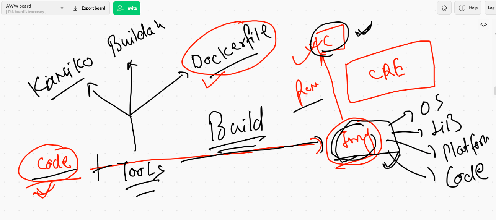
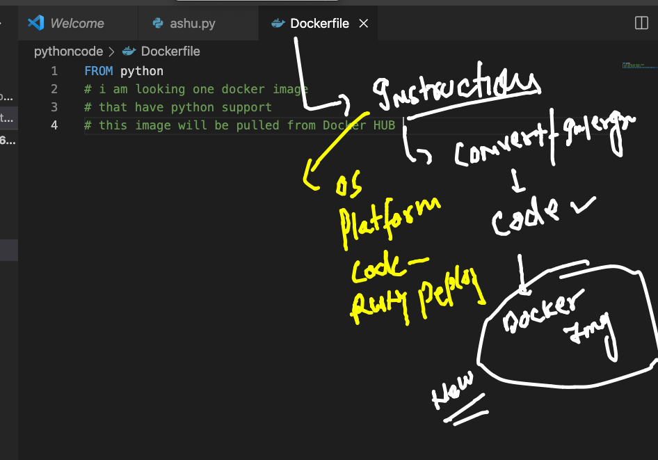
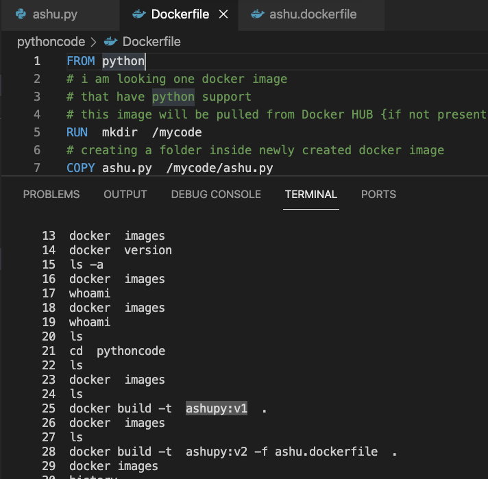
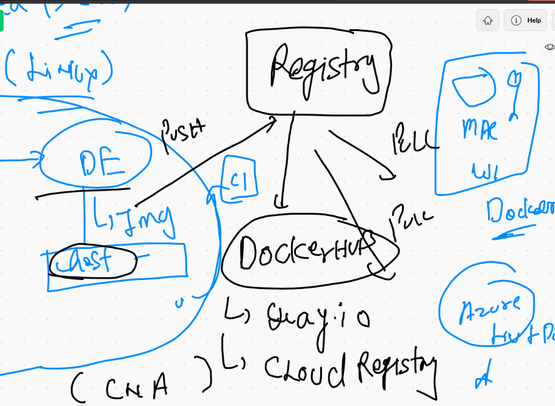
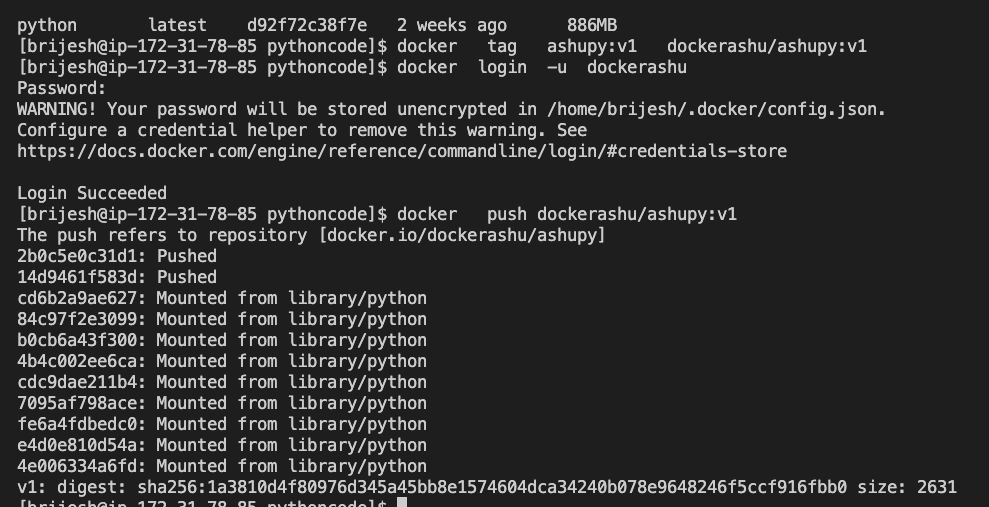
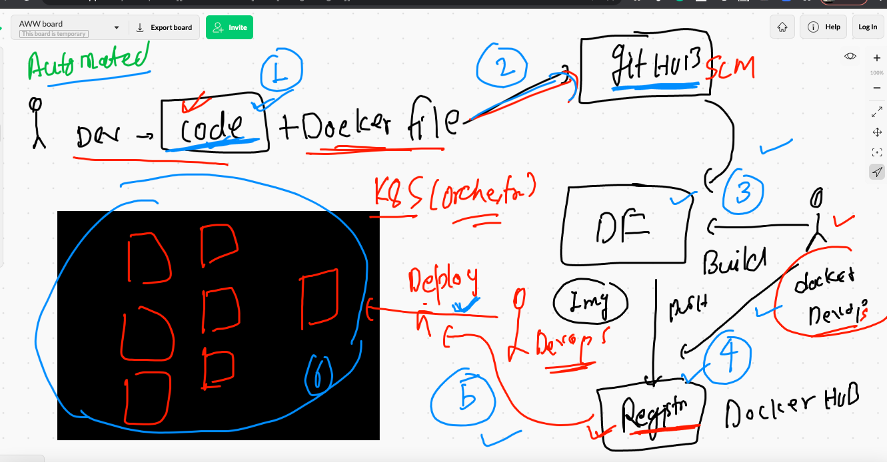
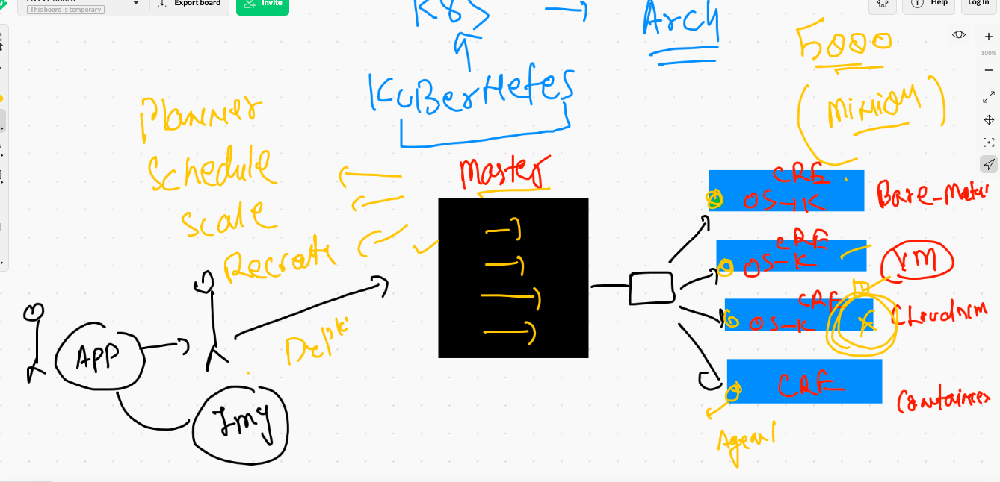

# Day3 revision 

## 


## APplication containerization 



## Starting with Dockerfile 



## building my python code into docker image

```
[brijesh@ip-172-31-78-85 pythoncode]$ docker build -t  ashupy:v1  . 
Sending build context to Docker daemon  3.072kB
Step 1/4 : FROM python
latest: Pulling from library/python
0bc3020d05f1: Pull complete 
a110e5871660: Pull complete 
83d3c0fa203a: Pull complete 
a8fd09c11b02: Pull complete 
14feb89c4a52: Pull complete 
70752631d778: Pull complete 
be0100d82341: Pull complete 
055b01fdac49: Pull complete 
7e4fe414911b: Pull complete 
Digest: sha256:604a312b2b55130a38ffa7a4d517417cbebd8704cb4ff1831ed0ced8ad40f425
Status: Downloaded newer image for python:latest
 ---> d92f72c38f7e
Step 2/4 : RUN  mkdir  /mycode
 ---> Running in fc4bd2c97a66
Removing intermediate container fc4bd2c97a66
 ---> b33939997aca
Step 3/4 : COPY ashu.py  /mycode/ashu.py
 ---> 9aafad5d71e6
Step 4/4 : CMD  ["python","/mycode/ashu.py"]
 ---> Running in 700fd5091d50
Removing intermediate container 700fd5091d50
 ---> ed5e9ae8f7a1
Successfully built ed5e9ae8f7a1
Successfully tagged ashupy:v1

```
### another build




## creating container 

```
[brijesh@ip-172-31-78-85 pythoncode]$ docker  run  -it  -d  --name  ashuc1  ashupy:v1 
9a40cca76f3b0916983dae9579d41083abb2f5fbaf90e8aaa577e80cb9e64960
[brijesh@ip-172-31-78-85 pythoncode]$ docker  ps
CONTAINER ID   IMAGE        COMMAND                  CREATED          STATUS          PORTS     NAMES
9a40cca76f3b   ashupy:v1    "python /mycode/ashu…"   3 seconds ago    Up 2 seconds              ashuc1
5a1e7abc42cf   karanpy:v1   "python /mycode/kara…"   31 seconds ago   Up 30 seconds             karanc1
[brijesh@ip-172-31-78-85 pytho

```

###  image sharing concept 



### pushing image to docker hub 



## containerization process


##  CNA adopting new model



### k8s in one go 



