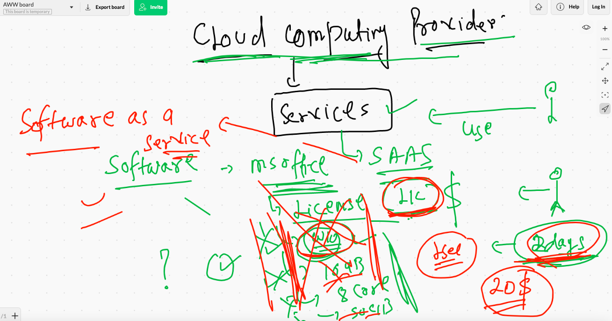
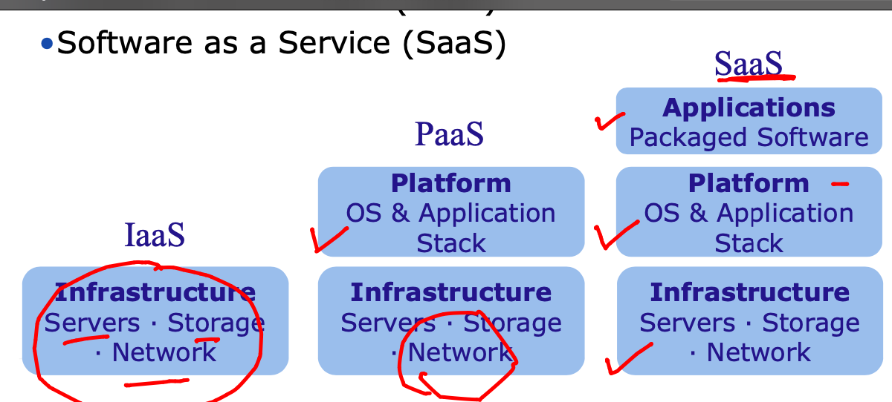
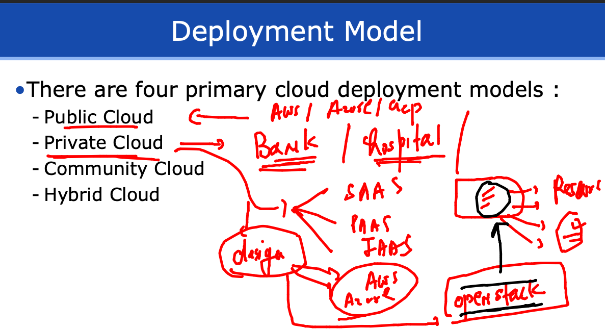

# Understanding app deployment problems in History 

## second problem while deploying app in bare-metal 

## Introduction to Hypervisor 

## TYpe of hyper visors

### type-2 hosted Hypervisor 

## TYpe1 hypervisor 

## Installation hypervisor need of virtualization support is must 

## Hypervisor list 

## CLoud computing -- start point 

## SAAS in cloud 

## Cloud services in real 

## final cloud service type

## public and private cloud 

## Region and zones in cloud 

