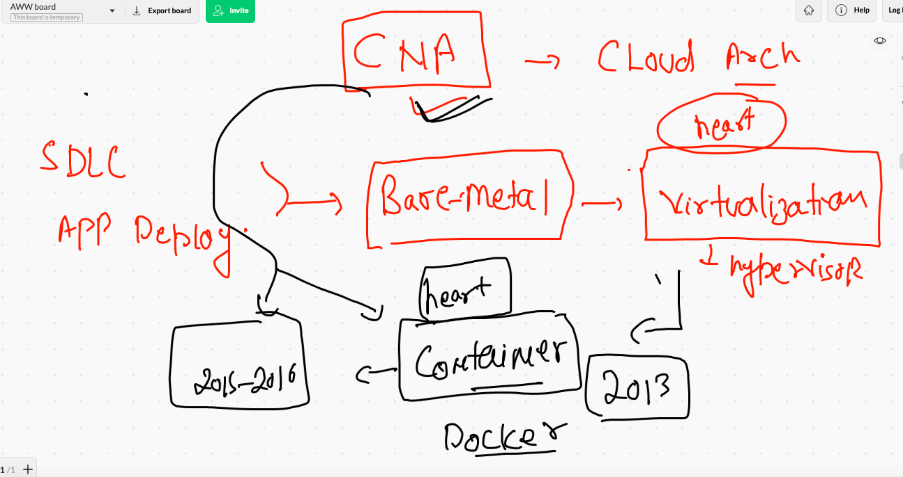

# CNA_cisco12thjuly2021

## CNA model 



## CNA -- IAC 


## webapp dockerfile nginx 


## Building image --

```
[brijesh@ip-172-31-78-85 webapp]$ docker  build -t  ashucisco:webappv1 . 
Sending build context to Docker daemon  3.072kB
Step 1/2 : FROM nginx
 ---> 4cdc5dd7eaad
Step 2/2 : COPY index.html /usr/share/nginx/html/index.html
 ---> fd65677f88de
Successfully built fd65677f88de
Successfully tagged ashucisco:webappv1

```

## pushing image to docker hub 

```
[brijesh@ip-172-31-78-85 webapp]$ docker  tag  ashucisco:webappv1  dockerashu/ashucisco:webappv1[brijesh@ip-172-31-78-85 webapp]$ docker  login -u  dockerashu
Password: 
WARNING! Your password will be stored unencrypted in /home/brijesh/.docker/config.json.
Configure a credential helper to remove this warning. See
https://docs.docker.com/engine/reference/commandline/login/#credentials-store

Login Succeeded
[brijesh@ip-172-31-78-85 webapp]$ docker push  dockerashu/ashucisco:webappv1
The push refers to repository [docker.io/dockerashu/ashucisco]
fed59d7739c0: Pushed 
9d1af766c818: Mounted from library/nginx 
d97733c0a3b6: Mounted from library/nginx 
c553c6ba5f13: Mounted from library/nginx 
48b4a40de359: Mounted from library/nginx 
ace9ed9bcfaf: Mounted from library/nginx 
764055ebc9a7: Mounted from library/nginx 
webappv1: digest: sha256:031404d7fee74956c48c1a12475d07f375bc73b19cfaafa836c36ab2e64f993d size: 1777
[brijesh@ip-172-31-78-85 webapp]$ docker  logout 
Removing login credentials for https://index.docker.io/v1/

```

## docker image pushing to docker hub 

```
 88  docker  build -t  ashucisco:webappv1 . 
   89  docker images
   90  docker  tag  ashucisco:webappv1  dockerashu/ashucisco:webappv1
   91  docker  login -u  dockerashu
   92  docker push  dockerashu/ashucisco:webappv1
   93  docker  logout 
   
```

## making your normal laptop as kubernetes client 


### connecting to k8s

```
❯ cd Desktop
❯ ls
CIsco_CNA    PHD          backup       cna.png      df.png       k8sc.png     techienest
DevopsSRE    admin.conf   cn1.png      cnapass.pem  helm2        linksdex.txt webapp_dev
❯ kubectl   get   nodes   --kubeconfig admin.conf
NAME         STATUS   ROLES                  AGE   VERSION
masternode   Ready    control-plane,master   25h   v1.21.2
node1        Ready    <none>                 25h   v1.21.2
node2        Ready    <none>                 25h   v1.21.2

```

## IAC first 


### saving yaml file 

```
 kubectl   create  deployment   ashuwebapp   --image=dockerashu/ashucisco:webappv1  --dry-run=client  -o  yaml  >ashudep1.yaml
```

## deploying 

```
❯ kubectl  apply  -f   ashudep1.yaml  --kubeconfig admin.conf
deployment.apps/ashuwebapp created

```

## checking deployment 

```
❯ kubectl  get  deployment  --kubeconfig admin.conf
NAME            READY   UP-TO-DATE   AVAILABLE   AGE
ashuwebapp      1/1     1            1           35s
mangeshwebapp   0/1     1            0           2s

```

### POd by k8s 


### scaling pod 

```
 kubectl  scale  deployment  ashuwebapp  --replicas=5  --kubeconfig admin.conf
deployment.apps/ashuwebapp scaled
❯ kubectl  get  deployment  --kubeconfig admin.conf
NAME            READY   UP-TO-DATE   AVAILABLE   AGE
aisgwebapp      1/1     1            1           15m
ashuwebapp      5/5     5            5           17m
karanwebapp     1/1     1            1           14m
mangeshwebapp   1/1     1            1           17m
sanupweb        1/1     1            1           16m
sudmwebapp1     1/1     1            1           9m7s
suyashwebapp    1/1     1            1           15m
vgkwebapp       1/1     1            1           16m
❯ kubectl  get  pod -o wide   --kubeconfig admin.conf
NAME                             READY   STATUS    RESTARTS   AGE     IP                NODE    NOMINATED NODE   READINESS GATES
aisgwebapp-698fc5788f-w4dxg      1/1     Running   0          15m     192.168.166.133   node1   <none>           <none>
ashuwebapp-d76f9d9c4-47vk2       1/1     Running   0          18s     192.168.166.139   node1   <none>           <none>
ashuwebapp-d76f9d9c4-4qt94       1/1     Running   0          18s     192.168.166.137   node1   <none>           <none>
ashuwebapp-d76f9d9c4-bcvsr       1/1     Running   0          18s     192.168.166.138   node1   <none>           <none>
ashuwebapp-d76f9d9c4-dg5lg       1/1     Running   0          7m19s   192.168.166.136   node1   <none>           <none>
ashuwebapp-d76f9d9c4-qc548       1/1     Running   0          18s     192.168.104.9     node2   <none>           <none>
karanwebapp-77f66f5955-pfw6l     1/1     Running   0          14m     192.168.166.135   node1   <none>           <none>
mangeshwebapp-65b56cdd46-mfq6l   1/1     Running   0          17m     192.168.104.5     node2   <none>           <none>
sanupweb-8df84b779-jxls8         1/1     Running   0          16m     192.168.166.132   node1   <none>           <none>
sudmwebapp1-f88cc954c-6fsfp      1/1     Running   0          9m20s   192.168.104.8     node2   <none>           <none>
suyashwebapp-ddc95dcb5-v7mfd     1/1     Running   0          15m     192.168.104.7     node2   <none>           <none>
vgkwebapp-9c79cc7fb-z28kc        1/1     Running   0          16m     192.168.104.6     node2   <none>           <none>

```

### load balancer creation here

```
❯ kubectl  get  deployment  --kubeconfig admin.conf
NAME            READY   UP-TO-DATE   AVAILABLE   AGE
aisgwebapp      1/1     1            1           18m
ashuwebapp      5/5     5            5           20m
karanwebapp     1/1     1            1           16m
mangeshwebapp   1/1     1            1           19m
sanupweb        1/1     1            1           19m
sudmwebapp1     1/1     1            1           11m
suyashwebapp    1/1     1            1           17m
vgkwebapp       1/1     1            1           18m
❯ kubectl  expose deployment ashuwebapp  --type LoadBalancer  --port 80  --kubeconfig admin.conf
service/ashuwebapp exposed
❯ kubectl  get  service  --kubeconfig admin.conf
NAME         TYPE           CLUSTER-IP      EXTERNAL-IP   PORT(S)        AGE
ashuwebapp   LoadBalancer   10.108.51.135   <pending>     80:31849/TCP   11s
kubernetes   ClusterIP      10.96.0.1       <none>        443/TCP        26h

```

## CI CD to explore 


