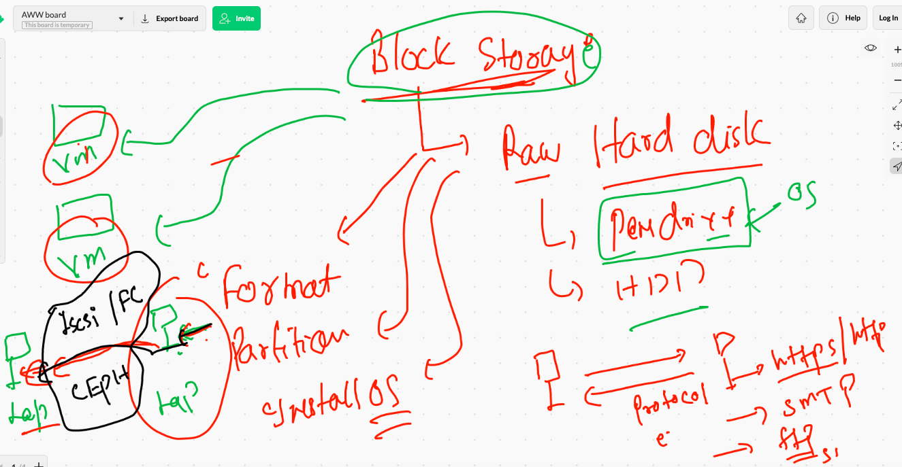
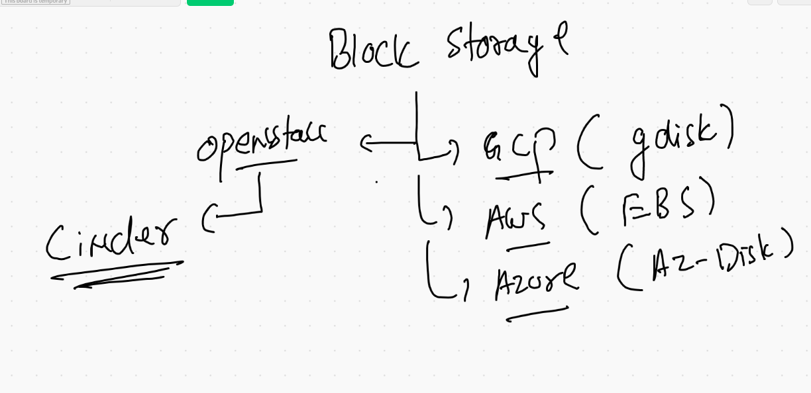

# CNA_cisco12thjuly2021

## CLoud computing over all things to remember 

## role of names in cloud services 

## St AAS 

##  object storage can not do 

## block storage 

## block storage examples 

## FIle storage 

## CNA as standard 

## HA in CLoud COmputing 

## HA 2 

## Auto scaling 

## HA 

## New services in CLoud arch 

## CNA moving modes -- Baremetal - vm- containerization 

