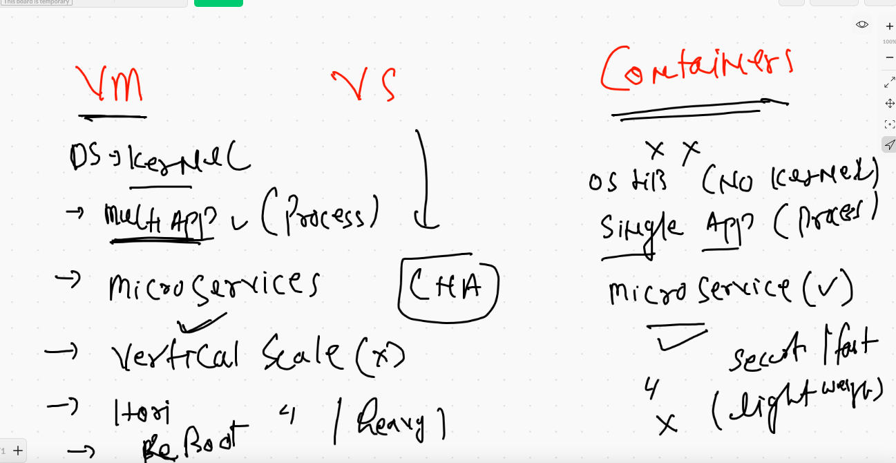

# CNA_cisco12thjuly2021

## CNA -- Baremetal -- Virtualization -- Containerization 


## problem with Virtaul machines 


### CNA definition for os 


### Kernel is reading details


### Kernel in VM


## VM vs containers


## COntainer in reality 


## CRE 


### Using docker 


## possible use of docker from end user


## Docker Desktop download 

### FOR MAC -- Intel chip 

[download](https://docs.docker.com/docker-for-mac/install/)

### WIndows 10 

[download](https://docs.docker.com/docker-for-windows/install/)


## Docker installation on CLouD Linux VM 


## DOcker architecture 


## VM vs containers



## Docker the big picture 


## COntainer life is the process running inside it 


### creating first container 


```
❯ docker  run  --name  ashuc1   -d   alpine:latest  ping 127.0.0.1
33624a34595048fbd9668ba866c53ec62c1fb9e64a61c37be7ae9675bbc13d04
❯ docker  ps
CONTAINER ID   IMAGE           COMMAND            CREATED         STATUS         PORTS     NAMES
33624a345950   alpine:latest   "ping 127.0.0.1"   2 minutes ago   Up 2 minutes             ashuc1


```

### container 


### problems with CRE 


### CNA heart is now containers and kubernetes 


## k8s in one go 


